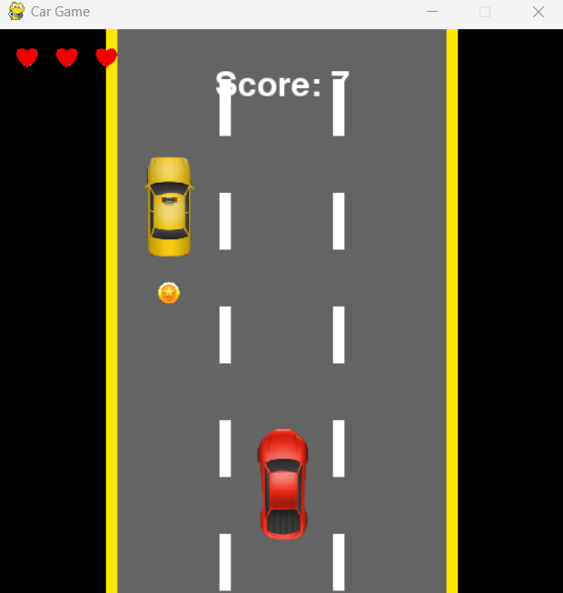

# Car Game 🚗

A simple yet fun 2D car game built using **Python** and **Pygame**. Avoid incoming vehicles, collect coins, and try to beat your high score!

---

## Features ✨

- **Player Movement:** Control the car using the left (←) and right (→) arrow keys.
- **Obstacles:** Avoid incoming vehicles to prevent collisions.
- **Collectibles:** Collect coins to increase your score.
- **Health System:** Lose health on collisions; game ends when health reaches zero.
- **High Score:** Track and save your highest score.
- **Dynamic Difficulty:** Speed increases as you progress, making the game more challenging.

---

## Screenshots 🖼️


*Gameplay in action!*

---

## How to Play 🎮

1. Use the **left (←)** and **right (→)** arrow keys to move the car.
2. Avoid collisions with other vehicles.
3. Collect coins to increase your score.
4. Survive as long as possible and beat your high score!

---

## Installation 🛠️

1. **Clone the repository:**
   ```bash
   git clone https://github.com/your-username/car-game.git

2. **Navigate to the project directory:**
   ```bash
   cd car-game

3. **Install the required dependencies:**
   ```bash
   pip install pygame

3. **Run the game:**
   ```bash
   python car_game.py

---

## File Structure 📂
Simple-CarGame/
├── images/ 
│ ├── car.png
│ ├── coin.png
│ ├── crash.png
│ ├── heart.png
│ ├── pickup_truck.png
│ ├── semi_trailer.png
│ ├── taxi.png
│ └── van.png
├── screenshots/ 
│ └── gameplay.png
├── car_game.py # Main game script
├── high_score.txt 
└── README.md 

## Contributing 🤝
Contributions are welcome! If you have any suggestions, bug reports, or feature requests, please open an issue or submit a pull request.


